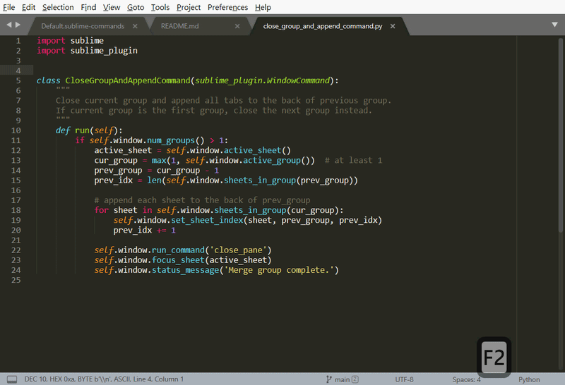

# CloseGroupAndAppend

A Sublime Text plugin to close current group (pane) and append all tabs to the **BACK** of the previous group. (The default only prepend to the **FRONT**)

## Usage

- Type in the *Command Palette* to use it.
    - I also added three other commands, namely `New Group`, `Move File to New Group` and `Close Group`.
- Or bind to a key binding with a command called `close_group_and_append`.

## Troubleshooting

- If you think you're facing a bug or other inconveniences, [please let me know](https://github.com/davidhcefx/CloseGroupAndAppend/issues)!
