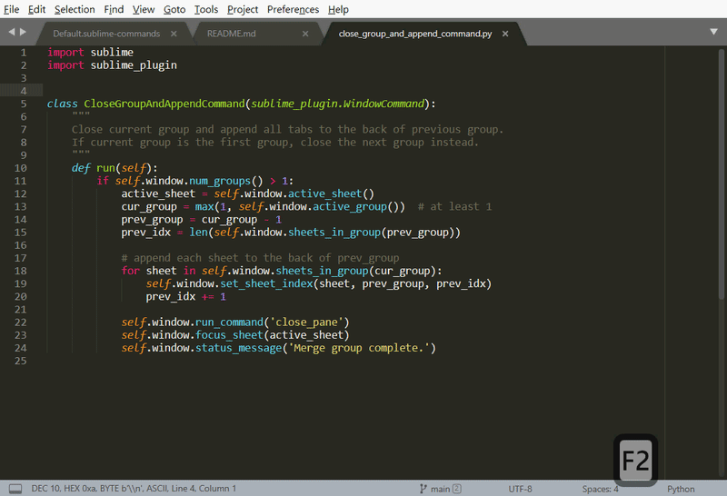

# CloseGroupAndAppend

A Sublime Text plugin to close current group (pane) and append all tabs to the **BACK** of the previous group. (The default can only prepend to the FRONT)

## Usage

- Type in the *Command Palette* to use it.
- Or bind to a key binding with command called `close_group_and_append`.
